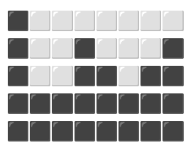
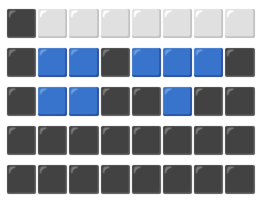
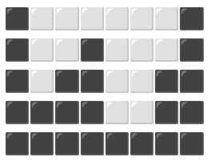
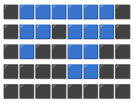

# Vega IT x Codefair 2024

Welcome to the Vega IT challenge for Codefair 2024. By solving it, you can win a place at our software developer workshop (and other cool things), where you will work with experienced developers to enhance your engineering skills.

## Rules

- Submit your solution before the deadline mentioned in the email.
- Submit it by forking this repository, solving the challenge, and opening a PR to this repository, assigning [@kostakupresak](https://github.com/kostakupresak) as the reviewer.
- Use any programming language to solve this challenge.

**Happy programming!**

## Challenge

Yesterday, a heavy rainstorm swept across Serbia, submerging almost all roads. This was particularly noticeable in Serbian villages, where dirt roads turned into muddy paths. The rain poured for hours, forming large puddles that stayed for days. Children in the villages, drawn to the puddles, began to wonder how they could calculate the water these puddles held. That's where they need your help.

In the following two examples, we are representing two puddles with squares. Black squares represent the road, blue squares represent water, and white squares represent empty space.

### Example A

This is how puddle A looks without water.

This is how puddle A looks with water.

**This puddle can hold 8 squares of water without the water spilling over.**

### Example B

This is how puddle B looks without water.

This is how puddle B looks with water.

**This puddle can hold 16 squares of water without the water spilling over.**

Can you write an algorithm that can calculate how many squares of water a puddle can hold based on the given structure?
